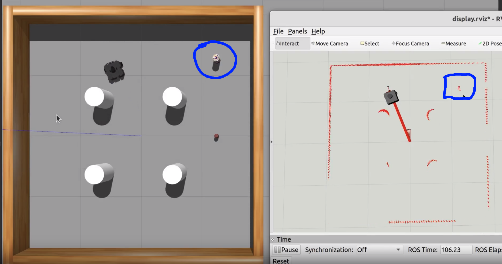
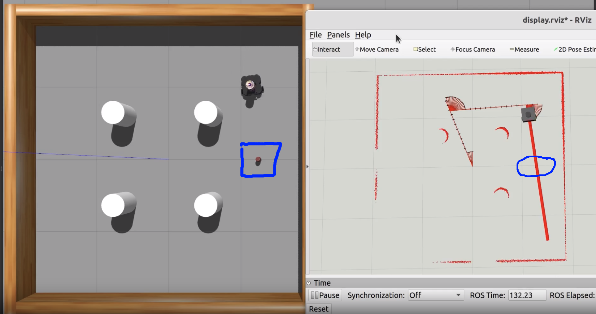

# Online Path Planner lab1

### Group Members 
   1. Eliyas Kidanemariam Abraha - u1992469
   2. Goitom Leaku  u1985499

## Table of Contents
1. [Introduction](#introduction)
2. [Implementation](#features)
3. [Usage](#usage)
4. [Demo Video](#demo)

## Introduction


## Implementation 
We have a robot with the follwong behaviors:

* `check_exploration_Done`: This behaviour checks blackboard variable [`exploration_done`] if the blackboard variable is true it returns sucess which means exploration is finished when two objects have been collected or all provided points have been explored. Otherwise it rereturns failure.This beihaviour is then Inverted using Invertion decorator to stop the excusion exploration is done.
* `explore`: This behaviour check if the 2 objects(coke_can and beer are collected) or all listed places are explored.If Two objected are not collected and there are more points to explore it writes the next `waypoint or goal` to blackboard  and published goal point to the planner then returns `Sucess`. Otherwise returns `Failure`.
* `plan and follow path`: In this behaviour the robot plans a path to the goal point and checks if it reaches the goal point with minimum threshold dstance.It returns `Running` when it is planning and following the path.When the the robot reaches the goal point it returns `Sucess`.This  behaviour is also checked by timeout decoretor to return `Failure` if after some timeout time of palnning. We consider if the robot is not reached the goal point after specfied time there is no valid path to the goal point retrn `Failure`


* `check_object`: A service provided by the [manage_objects_node.py](./src/manage_objects_node.py). It returns `False` if no object is close to the robot and `True` plus the object's name if an object is close to it.
* `get_object`: A service provided by the [manage_objects_node.py](./src/manage_objects_node.py). It returns `False` if no object is close to the robot and `True` if an object is close to it. It also moves this object over the robot.
* `let_object`: A service provided by the [manage_objects_node.py](./src/manage_objects_node.py). It returns `False` if no object is over the robot and `True` if an object is over it. It also moves this object to the floor.

### path planning controller 

In Order to do pick and place task while avoiding obstacles we incorporate the previously done RRT-Star planner. We reduce the dominion area to [-5 ,5,-5,5] beacause it is small area and we are using RRT Star to get shorter path.We implement both palanning and follow path at one behaviour and bound it by time out to return `Failure` if path is not found with in specified  time.
In the state validity  checker we define the locations of coke_can and beer as special places.The State Validity checker returns `True` if those special points are come as `goal point` from    `path-cheker` but we consider them as normal point when they are not goal points. 


### Problems found.

#### Lidar Obstacle detection Problem 

The Problem we encouter is the coke_can is too small to detect by the lidar while the beer is detected as obstacle.The Planner takes as a valid point the area around the coke and plannes a path through it and the robot stacks with the beer. We try to change  the coke model or modifie the size in the `sdf` file but it does not work.Another solution could be saving the coke location as global point when the location is randomly generated and consider it as obstcle but it is adding complexity to the program.

<div style="display: flex; justify-content: center;">
    <div style="flex: 1; margin-right: 5px;">
        
        <p style="text-align: center;">Figure 1: Beer Lidar Detection </p>
    </div>
    <div style="flex: 1; margin-right: 5px;">
        
        <p style="text-align: center;">Figure 2: coke_can Lidar Detection </p>
    </div>
</div>


This someimes doesnot work if the robot bounded inside to obstacles.


## Remark 


## Usage
 to run the pick and place run the following commands 
  ```sh
  # to run the basic(stage 1)
  roslaunch pick_up_objects_task pick_up_objects_task_basic.launch
  roslaunch rosrun  pick_up_objects_task pickup_behaviors_node.py 
  ```
  to run the  pick and place with planner run the follow command(bonus)
 ```sh
  
  # to run the second stage
  roslaunch pick_up_objects_task pick_up_objects_task_planning.launch
  roslaunch rosrun  pick_up_objects_task pickup_behaviors_node.py 
  ```
  ###  Demo 1
Watch a demo of our project in action:
Demo1 
<video width="640" height="360" controls>
  <source src="./media/planning.mp4" type="video/mp4">
</video>


